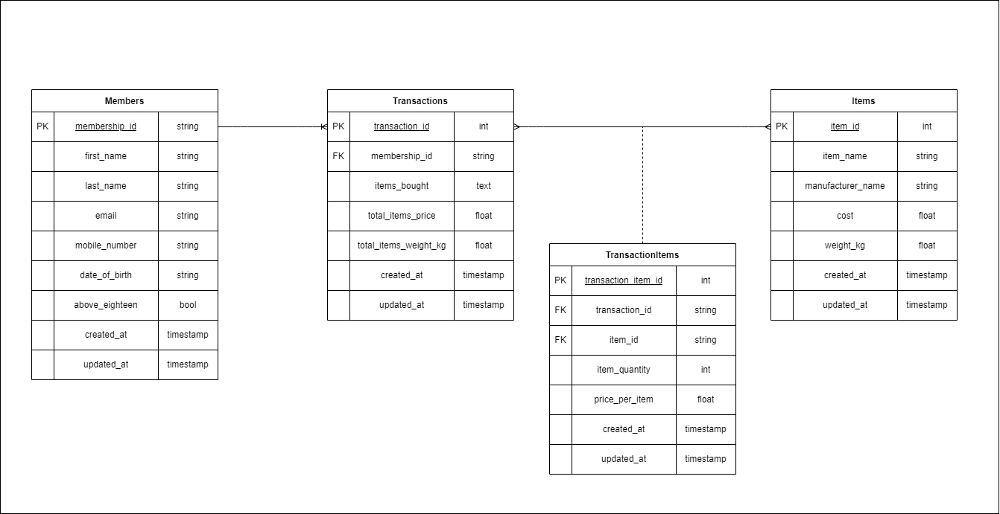

# Question 2: Databases

This section will cover the modelling and setting up of postgres database using docker.

## Table of Contents

- [Project Description](#project-description)
- [Key Requirements Gathered](#key-requirements-gathered)
- [Getting Started](#getting-started)
    - [Prerequisites](#prerequisites)
    - [Steps](#steps)
- [Indexing Considerations](#indexing-considerations)
- [Entity Relationship Diagram](#entity-relationship-diagram)

## Project Description

This project will cover key requirements considered during the planning phase. This includes a short walk through the set up procedure, and some other database design concerns addressed later on.

For the required submission criteria, they can be found in this project repo under the following:
- `sql-query-answers/query-answers.sql` script (answers the two given questions for querying)
- `DockerFile` and `docker-compose.yml` files (for standing up postgres database in docker container)
- `entity-relationship.drawio` and `entity-relationship.png` files (entity diagram)

## Key Requirements Gathered

Identified tables to create:
- Members (follows schema from the processed data from part 1)
- Items (schema based on the given)
- Transactions (schema based on the given)
- TransactionItems (junction table for m-to-m relationship btwn Items and Transactions and to track state of current item price)

## Getting Started

### Prerequisites

Docker version 4.22.0 was used for this project:

- postgres:15.1-alpine

### Steps

1. Ensure that your terminal is in the part-2-databases folder. 
2. Change to the project directory (if required): `cd part-2-databases`
3. Once in the correct directory, start up docker: `docker compose up -d`
4. To access and play around with the postgres db:
```bash
# If password is prompted, the pw is 'andicannotlie'
docker exec -it task-2-postgresql-container psql -U ilovebigdata
```
5. After you are done with the docker container: `docker compose down`

## Indexing Considerations

The following fields for each table were identified as potential fields that would be used frequently during querying, and hence indexing has been applied.

Items:
- item_name

Transactions
- membership_id

TransactionItems
- transaction_id


## Entity Relationship Diagram

- Members has a one is to many relationship with Transactions table.
- Transactions has a many to many relationship with Items, with TransactionItems table being the junction table.
- Fields created_at and updated_at were added for any audit purposes.
- For updated_at fields, it is assumed that the updating of these fields will be done by the application uploading data.