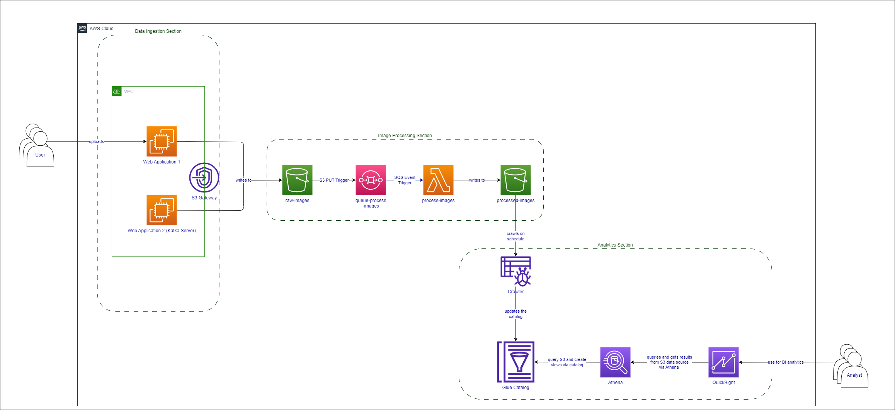

# Question 3: System Design

For this section, I will be designing the data infrastructure of the given proposal on AWS Cloud. 

## Table of Contents

- [Project Description](#project-description)
- [Key Requirements Gathered](#key-requirements-gathered)
- [Potential Cloud Services](#potential-cloud-services)
- [Tackling The Requirements](#tackling-the-requirements)
- [Architect Diagram](#architect-diagram)

## Project Description

For this system design project, I chose to go with AWS Cloud. In the following sections I will first go through the requirements I gathered from the question, followed by services I identified that would be useful for the required data infra, and lastly I will go through my thought process for tackling said requirements.

The architecture diagram can be found in the last section.

## Key Requirements Gathered
- Web application 1 (user uploads)
- Web application 2 (hosts Kafka stream for image upload)
- Code prepared for image processing, requires to be hosted on cloud.
- Stored images and metadata in cloud env needs to be purged after 7 days.
- Cloud env requires a Business Intel resource for analysts.

## Potential Cloud Services
- VPC
- EC2
- SQS
- Lambda
- Fargate
- S3
- Glue
- Athena
- QuickSight

## Tackling The Requirements
### Web application 1
An EC2 hosted within a VPC (along with its subnets, security groups etc.) can be used to run the web application, wherein user uploads can be uploaded to an S3 bucket via AWS SDK. (Utilize VPC Endpoint to route directly to the S3 bucket of choice)

### Web application 2
The web application hosting Kafka stream can be set up in another EC2 instance. This will allow the company's engineer who are required to self-manage the Kafka stream to have more control over the Kafka cluster. Similarly, the Kafka consumers can upload the image messages up to S3 bucket via AWS SDK. (Similarly, VPC Endpoint will be used)

### Prepared code for image processing
For the image processing that requires to be hosted on cloud, we can deploy the code on Lambda. When raw images are sent to the raw-images bucket, a PUT event notification will be sent to the SQS queue, which in turn triggers the Lambda to process the data and output the processed images and metadata into the processed-images S3 bucket. (we could use 'images/' and 'metadata/' as prefixes in this output data to help with the BI portion later). SQS is used here to help us decouple and control the rate of firing the Lambda to avoid any possible hitting of the max lambda concurrency cap.

Note: If the code that processes the images requires more than 10GB of RAM or more than 15mins of runtime, we would shift over to AWS Fargate instead.

### Stored images/metadata 7 day purge
Given that raw and processed data exist within S3 buckets, we can simply set an S3 Lifecycle Policy rule to delete the items after 7 days. As it was not specified whether all or only certain data should be purged, we will be purging data from all buckets. However if there is a need to delete only some of the data, we could use the S3 bucket prefixes to be more specific.

### Business Intelligence
To help the analysts out, we could use Glue, Athena and QuickSight as the BI resources.
1. Firstly we can run Glue crawlers to run through the processed data bucket to create tables in the Glue Catalog. Prefixes like 'images/' and 'metadata/' could help with partitioning the data better for the crawlers to catalog.
2. Athena can be used to query the tables created in the Glue Catalog, perform any additional data transformation and create Views.
3. QuickSight will then utilize these Views from Athena for visualization and further analytical purposes.

## Architect Diagram

- Image data for processing is retrieved in the Data Ingestion Section.
- Images are processed in a serverless fashion in the Image Processing Section. S3 buckets have a lifecycle policy of 7 days for scheduled deletion.
- The stack of Glue, Athena and QuickSight is used as the BI resource within the Analytics Section to help the company's analysts access and perform their analytics on the stored data.